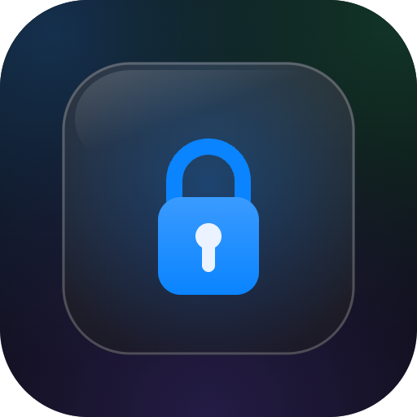

<p align="center">
  
</p>

# viewport-lock — 行動裝置鎖縮放

[English](#english) | [繁體中文](#繁體中文)

A tiny (zero-dependency) helper that stops **pinch-zoom and double-tap-zoom on
mobile** while keeping normal scrolling. iOS-aware: Safari ignores
`user-scalable=no`, so this also blocks the proprietary `gesture*` events.

---

## English

### Why

`<meta name="viewport" content="...user-scalable=no, maximum-scale=1">` is
**ignored by iOS Safari** (since iOS 10, for accessibility). So a meta-only fix
does nothing on iPhone. `viewport-lock` covers every case:

| Browser | Pinch zoom | Double-tap zoom |
| --- | --- | --- |
| Android Chrome | viewport meta | meta + `touch-action` |
| iOS Safari | `gesturestart/change/end` `preventDefault` | `touch-action: manipulation` |

Normal scrolling and single taps are untouched.

> **Accessibility note:** disabling zoom is an accessibility trade-off
> (low-vision users pinch to read). Use it on fixed, app-like layouts where
> zoom breaks the design — not on long-form reading content.

### Install

```jsonc
// package.json — pin a commit SHA (this ecosystem's convention)
"dependencies": {
  "viewport-lock": "github:lp250isme/viewport-lock#<sha>"
}
```

### Use

**React / Next.js** (call once in a client component; the return value is the cleanup):

```tsx
"use client";
import { useEffect } from "react";
import { lockViewport } from "viewport-lock";

useEffect(() => lockViewport(), []);
```

**Vanilla / Vite entry:**

```ts
import { lockViewport } from "viewport-lock";
lockViewport();
```

### Options

```ts
lockViewport({
  meta: true,      // create/patch <meta viewport> (Android). default true
  doubleTap: true, // html{touch-action:manipulation}. default true
  pinch: true,     // iOS gesture* preventDefault. default true
});
```

Returns a cleanup function that restores every change.

### Note for map / canvas apps

It blocks **page** zoom, not a widget's own gestures — map libraries (Leaflet,
Mapbox) compute zoom from touch events and set their own `touch-action`, so
pinch-to-zoom-the-map keeps working.

---

## 繁體中文

### 為什麼需要

`<meta name="viewport" content="...user-scalable=no, maximum-scale=1">`
**iOS Safari 自 iOS 10 起故意無視**(無障礙考量),所以光改 meta 在 iPhone 上
完全沒用。`viewport-lock` 把各家瀏覽器都顧到:

| 瀏覽器 | 雙指縮放 | 雙擊縮放 |
| --- | --- | --- |
| Android Chrome | viewport meta | meta + `touch-action` |
| iOS Safari | `gesturestart/change/end` `preventDefault` | `touch-action: manipulation` |

正常捲動、單擊完全不受影響。

> **無障礙提醒:** 關閉縮放是一種取捨(低視力使用者靠雙指放大閱讀)。用在
> 版面固定、縮放會破壞設計的 app 型頁面就好,長文閱讀類內容不建議關。

### 安裝

```jsonc
// package.json — 釘 commit SHA(本生態系慣例)
"dependencies": {
  "viewport-lock": "github:lp250isme/viewport-lock#<sha>"
}
```

### 使用

**React / Next.js**(在 client component 呼叫一次,回傳值就是清除函式):

```tsx
"use client";
import { useEffect } from "react";
import { lockViewport } from "viewport-lock";

useEffect(() => lockViewport(), []);
```

**Vanilla / Vite 進入點:**

```ts
import { lockViewport } from "viewport-lock";
lockViewport();
```

### 選項

```ts
lockViewport({
  meta: true,      // 建立/更新 <meta viewport>(Android)。預設 true
  doubleTap: true, // html{touch-action:manipulation}。預設 true
  pinch: true,     // iOS gesture* preventDefault。預設 true
});
```

回傳清除函式,還原所有變更。

### 地圖 / canvas 類 app 注意

它擋的是**整頁**縮放,不是元件自己的手勢——地圖庫(Leaflet、Mapbox)用 touch
事件自己算縮放、自己設 `touch-action`,所以「雙指縮放地圖」照常可用。

---

## More by kv

[kvcc.me](https://kvcc.me) · 更多小工具與作品。

## License

MIT © kv
